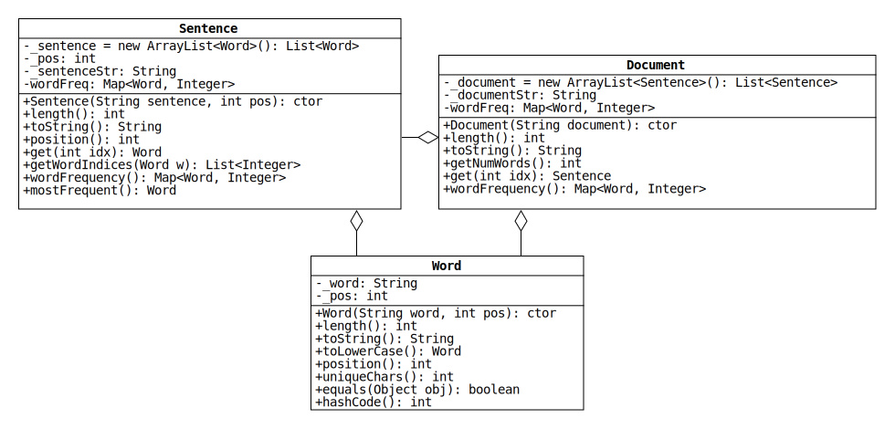

# Lab 8: Word Frequencies

In this lab, we will use Java Collections and some Object-Oriented Programming concepts to analyze text documents.
In this lab, we will implement three different classes: Word, Sentence, and Document. A Document represents a text
documents that consists of one or more sentences. Each sentence contains multiple words, and a word is simply a number of characters.

Below is a UML diagram with the details:

## Word

This class is a wrapper around a word (or a string). It has two data fields:
- `_word`: A String representing the word.
- `_pos`: An integer representing the position (index) of a word within its sentence.
The `Word` class has the following methods:
- `Word(String, int)`: The `Word` Constructor. Takes two arguments: a String representing the word, and an integer representing the index of
the word within its sentence. It first checks if the argument String is null. If that is the case, it throws a `NullPointerException`. Then,
it checks whether the value of the integer `pos` is negative. If it happens to be negative, it throws an `IllegalArgumentException`. If the input
arguments are valid, it initializes the class data fields accordingly.
- `length()`: Returns the length of the word (number of characters in the string).
- `toString()`: Returns the string representation of the word.
- `position()`: Returns the integer representing the position of the word in its sentence.
- `toLowerCase()`: Returns a new `Word` object, where the string representation is all lower case.
- `uniqueChars()`: Returns the number of unique characters in a word. For example, if the word string is `Event`, `uniqueChars` should return a 
value of `4`. Hint: get the lower case version of the word first before counting the number of characters so that both `E` and `e` count as the same
character.
- `hashCode()`: Returns the hashcode of the *lower case* string representation of the word.
- `equals(Object)`: Overrides the Object's `equals()` method. If the argument Object is null, return false. If both objects are not of the same class,
return false. If the previous test passed without returning false, cast the argument object as a `Word` object. Then, get the lower case version of both objects.  Compare String representations of both Words. If they are equal, return true. Otherwise, return false.

## Sentence
This class represents a sentence. It has the following data fields:
- `_sentence`: A list of `Word` objects, representing the words in the sentences.
- `_pos`: An integer representing the position (index) of the sentence within the document.
- `_sentenceStr`: A String representation of the sentence.
- `wordFreq`: A Map where the keys are `Word` objects, and the values are `Integer`s. This map stores the frequency (i.e. number of occurrences) of each word in the sentence.
The `Sentence` class has the following methods:
- `Sentence(String, int)`: The `Sentence` constructor. Takes a String representation of the sentence and an integer representing the position of the sentence within the document.
If the string is null, it throws a `NullPointerException`. If the position is a negative integer, it throws an `IllegalArgumentException`. If the input
arguments are valid, it initializes the class data fields accordingly. In order to fill the `_sentence` List, the string representation should be `split()` using spaces to extract
individual words.
- `length()`: Returns the length (number of words) in the sentence.
- `toString()`: Returns the string representation of the sentence.
- `position()`: Returns the position (index) of the sentence in the document.
- `get(int)`: Returns the `Word` at the given index. If the index is out of bounds, it throws an `IndexOutOfBoundsException`
- `getWordIndices(Word)`: Given a Word, this method returns a list of all the indices at which this Word appears in the sentence. If the argument Word is null, throw a `NullPointerException`.
This method should be case-insensitive. For example, if the sentence string is "Hello Java" and the word string is "hello", this method should still return a list containing one item: 0.
If the word does not exist in the sentence, return an empty list.
- `wordFrequency()`: Returns a Map of `Word`-`Integer` pairs representing the frequency of each word in the sentence. Make sure to use the lower case version of the word before inserting it
into the returned map.
- `mostFrequent()`: Returns the most frequent `Word` in the sentence.

## Document
This class represents a a text document. It has the following data fields:
- `_document`: A list of `Sentence` objects.
- `_documentStr`: A String representation of the document.
- `wordFreq`: A Map where the keys are `Word` objects, and the values are `Integer`s. This map stores the frequency (i.e. number of occurrences) of each word in the entire document.
The `Document` class has the following methods:
- `Document(String)`: The `Document` constructor. Takes a String representation of the text document. If this string is null, it throws a `NullPointerException`. It initializes the different data fields.
The `_document` list is filled by `split`ing the input string into sentences using the "." seperator (no spaces). 
- `length()`: Returns the length (number of sentences) in the document.
- `toString()`: Returns the string representation of the document.
- `getNumWords()`: Returns the total number of words in the document.
- `get(int)`: Returns the `Sentence` at the given index. If the index is out of bounds, it throws an `IndexOutOfBoundsException`
- `wordFrequency()`: Returns a Map of `Word`-`Integer` pairs representing the frequency of each word in the entire document. 

### Additional Notes
- The function of collecting partial word frequencies (mapping), then merging them together into one map (reduction) is a basic example of the popular [MapReduce](https://en.wikipedia.org/wiki/MapReduce) Programming Model.
- This [StackOverflow link](https://stackoverflow.com/questions/2265503/why-do-i-need-to-override-the-equals-and-hashcode-methods-in-java) provides a good discussion of why overriding `equals()` and `hashCode()` is necessray
for a custom class when using a key of that class in a `Map`.
